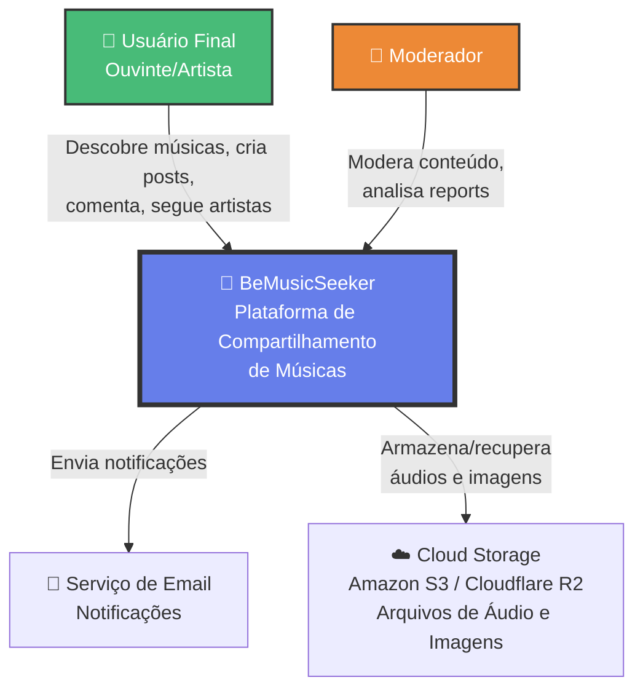
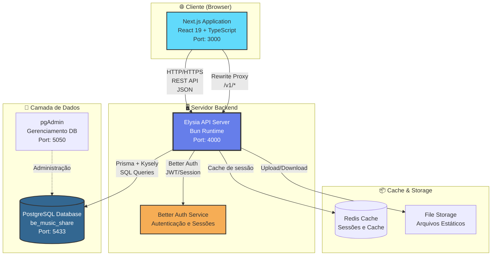
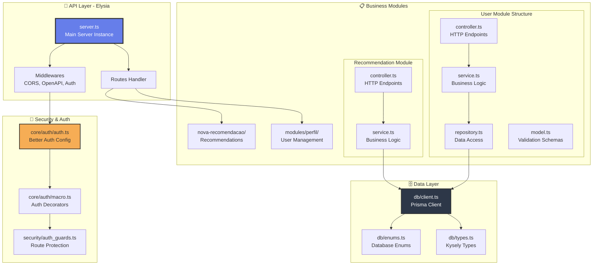
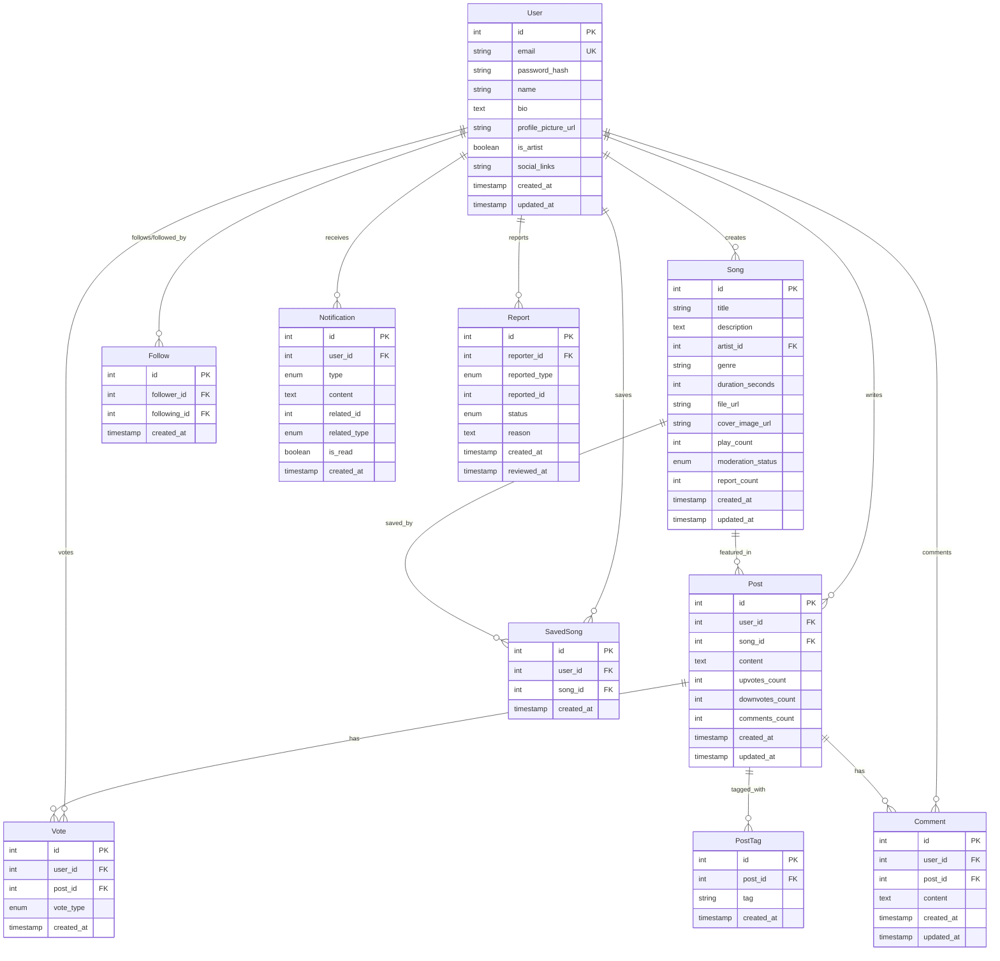
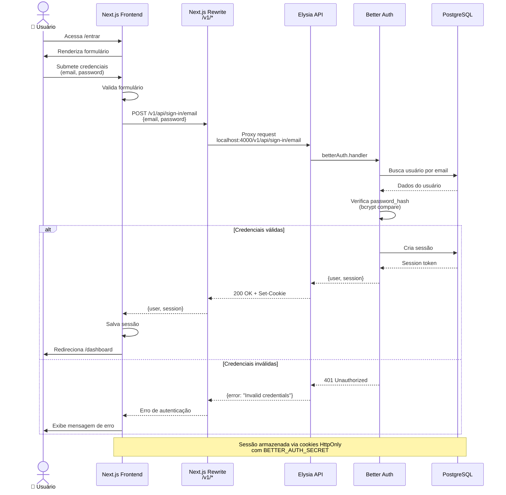
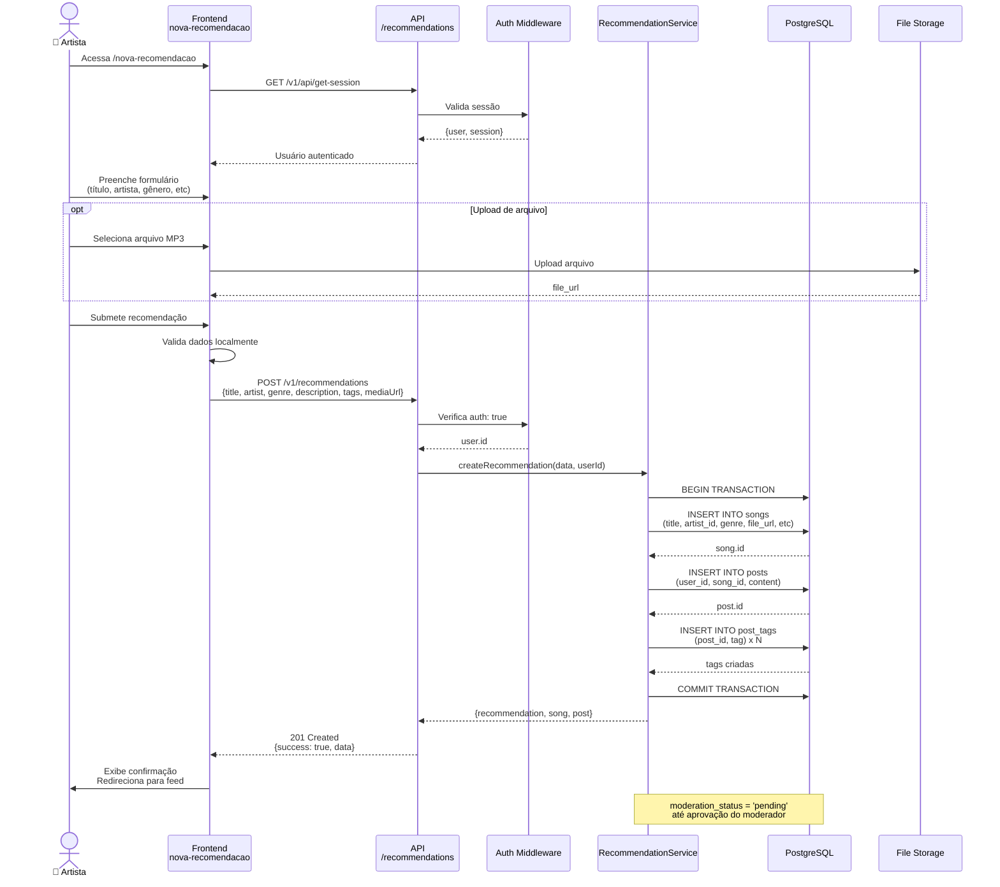
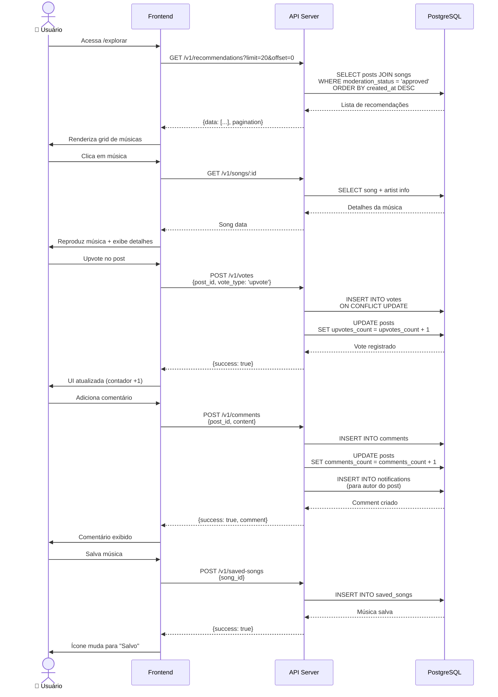
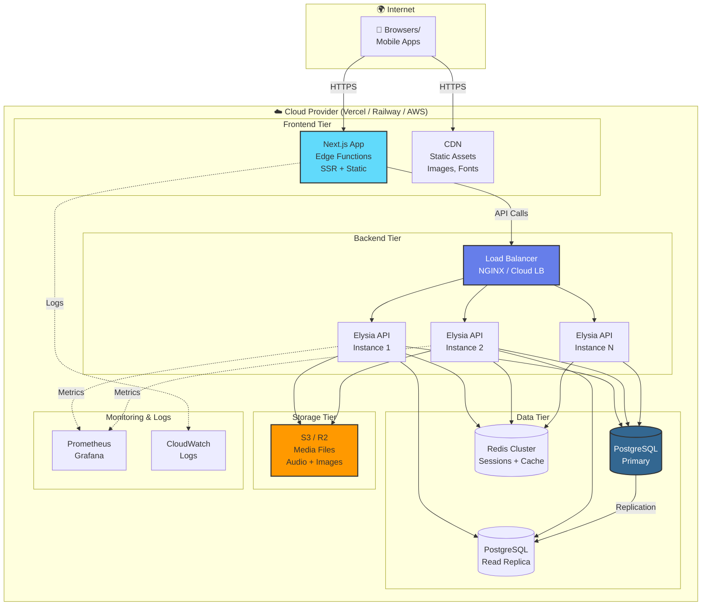
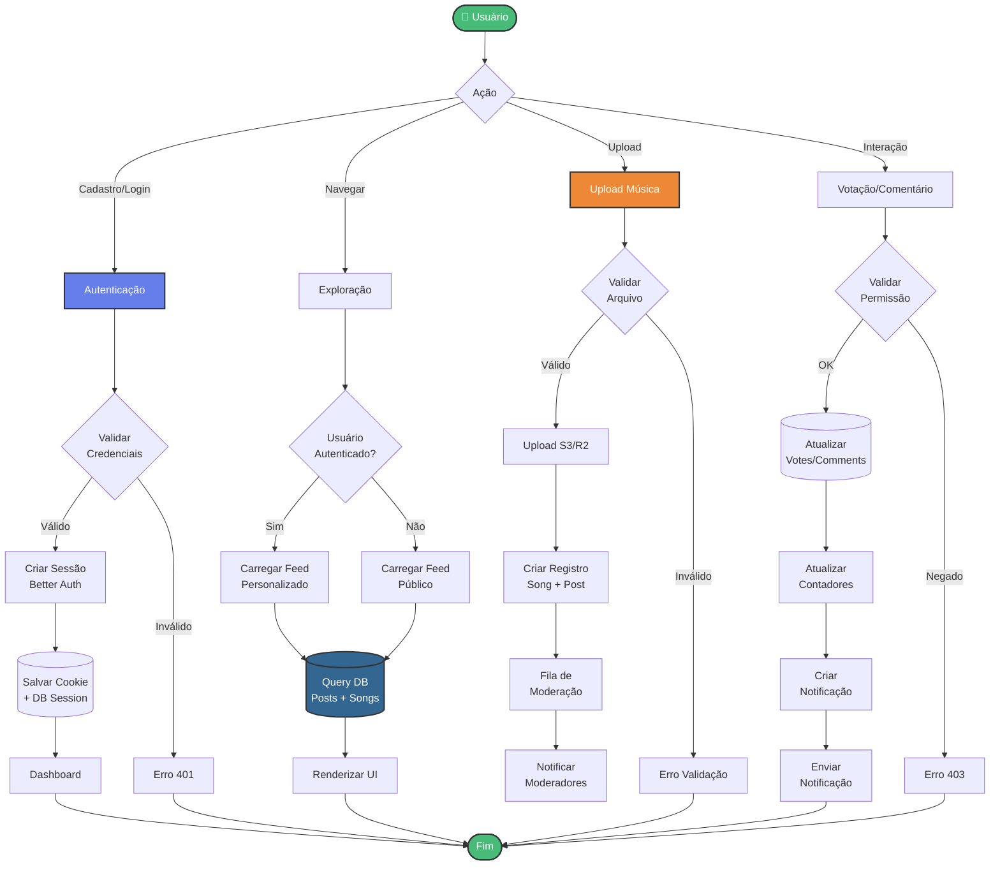
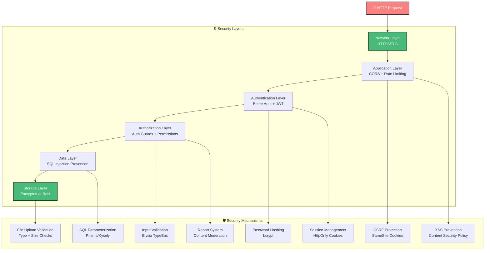

# Arquitetura do Sistema BeMusicSeeker

## 1. Diagrama de Contexto (C4 - Nível 1)



## 2. Arquitetura de Containers (C4 - Nível 2)



## 3. Arquitetura de Componentes - Backend



## 4. Arquitetura de Componentes - Frontend

```mermaid
graph TB
    subgraph "🎨 Next.js Application"
        Layout[app/layout.tsx<br/>Root Layout]
        
        subgraph "📄 Pages (App Router)"
            Home[page.tsx<br/>Landing Page]
            Login[entrar/page.tsx<br/>Login]
            Register[cadastro/page.tsx<br/>Register]
            Dashboard[dashboard/page.tsx<br/>User Dashboard]
            Profile[perfil/[username]/page.tsx<br/>User Profile]
            Explore[explorar/page.tsx<br/>Discover Music]
            Favorites[favoritos/page.tsx<br/>Saved Songs]
            NewReco[nova-recomendacao/page.tsx<br/>Create Recommendation]
            Rankings[rankings/page.tsx<br/>Top Charts]
            Following[seguindo/page.tsx<br/>Feed]
            Trending[trending/page.tsx<br/>Trending]
            Config[configuracoes/page.tsx<br/>Settings]
        end
        
        subgraph "🧩 Components"
            UI[components/ui/<br/>Radix UI Components]
            Custom[Custom Components<br/>Cards, Players, etc]
        end
        
        subgraph "📡 API Layer"
            APILib[lib/api.ts<br/>API Client]
            APIReco[lib/api/recommendations.ts<br/>Recommendations API]
            Utils[lib/utils.ts<br/>Utilities]
        end
    end
    
    Layout --> Home
    Layout --> Login
    Layout --> Register
    Layout --> Dashboard
    Layout --> Profile
    Layout --> Explore
    Layout --> Favorites
    Layout --> NewReco
    Layout --> Rankings
    Layout --> Following
    Layout --> Trending
    Layout --> Config
    
    Dashboard --> UI
    Profile --> UI
    Explore --> Custom
    NewReco --> Custom
    
    Login --> APILib
    Register --> APILib
    Dashboard --> APILib
    NewReco --> APIReco
    
    APILib --> Utils
    APIReco --> APILib
    
    APILib -->|HTTP Requests| Backend[Backend API<br/>localhost:4000]
    
    style Layout fill:#61dafb,stroke:#333,stroke-width:3px
    style APILib fill:#667eea,stroke:#333,stroke-width:2px,color:#fff
    style Backend fill:#2d3748,stroke:#333,stroke-width:2px,color:#fff
```

## 5. Modelo de Dados (ER Diagram)



## 6. Fluxo de Autenticação



## 7. Fluxo de Criação de Recomendação



## 8. Fluxo de Descoberta e Interação



## 9. Arquitetura de Deploy (Infraestrutura)



## 10. Fluxo de Dados Completo (Data Flow)



## 11. Stack Tecnológico Detalhado

```mermaid
graph LR
    subgraph "Frontend Stack"
        A1[Next.js 16<br/>App Router]
        A2[React 19]
        A3[TypeScript]
        A4[Tailwind CSS 4]
        A5[Radix UI]
        A6[Lucide Icons]
    end
    
    subgraph "Backend Stack"
        B1[Elysia 1.4<br/>Web Framework]
        B2[Bun Runtime]
        B3[TypeScript]
        B4[Better Auth 1.4<br/>Authentication]
        B5[@elysiajs/openapi<br/>Swagger]
        B6[@elysiajs/cors<br/>CORS]
    end
    
    subgraph "Database Stack"
        C1[(PostgreSQL 18)]
        C2[Prisma ORM]
        C3[Kysely<br/>Type-safe SQL]
        C4[pgAdmin<br/>Management]
    end
    
    subgraph "DevOps Stack"
        D1[Docker<br/>Compose]
        D2[Git<br/>Version Control]
        D3[ESLint<br/>Linting]
        D4[Oxlint<br/>Fast Linter]
    end
    
    A1 --> A2
    A2 --> A3
    A1 --> A4
    A2 --> A5
    A5 --> A6
    
    B1 --> B2
    B1 --> B3
    B1 --> B4
    B1 --> B5
    B1 --> B6
    
    C2 --> C1
    C3 --> C1
    C4 --> C1
    
    style A1 fill:#61dafb,stroke:#333,stroke-width:2px
    style B1 fill:#667eea,stroke:#333,stroke-width:2px,color:#fff
    style C1 fill:#336791,stroke:#333,stroke-width:2px,color:#fff
    style D1 fill:#2496ed,stroke:#333,stroke-width:2px,color:#fff
```

## 12. Arquitetura de Segurança



---

## Convenções dos Diagramas

### Cores:
- 🔵 **Azul (#667eea)**: Backend/API Services
- 🟢 **Verde (#48bb78)**: User/Success/Security OK
- 🟠 **Laranja (#ed8936)**: Auth/Admin/Warning
- 🔴 **Vermelho (#fc8181)**: Errors/Threats
- ⚫ **Cinza (#2d3748)**: Database/Storage
- 🟦 **Azul Claro (#61dafb)**: Frontend/React

### Símbolos:
- 👤 Usuário/Actor
- 🎵 Aplicação Principal
- 📧 Email/Notificações
- ☁️ Cloud Services
- 💾 Banco de Dados
- 🔒 Segurança
- 📦 Cache/Storage
- 🌐 Cliente/Browser

---

## Como Visualizar

1. **GitHub/GitLab**: Os diagramas Mermaid são renderizados automaticamente
2. **VS Code**: Instale a extensão "Markdown Preview Mermaid Support"
3. **Online**: Cole em https://mermaid.live/
4. **Obsidian**: Renderização nativa de Mermaid
5. **Notion**: Use blocos de código com syntax `mermaid`

---

## Atualizações

- **Versão**: 1.0
- **Data**: 18/12/2025
- **Autor**: Equipe BeMusicSeeker
- **Próximas Atualizações**: 
  - Adicionar diagramas de sequência para fluxos de moderação
  - Incluir diagramas de capacidade e escalabilidade
  - Documentar estratégias de cache
